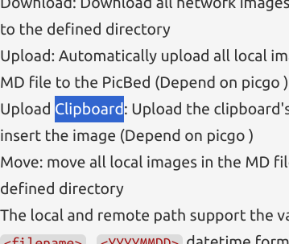

# Todo list

- [x] multithread
- [x] send chat message
    - [x] relay mode
    - [x] direct mode
        - [x] Server: create mutex lock for every client socket
- [x] Message Encryption with OpenSSL
- [x] transfer file with encryption
    - [ ] very big files
        1. disallow sending file size more than some threshold?
        2. read and send chunks at the same time?
- [x] streaming
    - [x] audio
    - [ ] video
- [ ] 5~10 min demo video

## Bugs
- [ ] remove error codes, use 1 for all errors and add error message field
- [x] login -> exit, server need to logout that user
- [x] a b client, a exit, b read eof (its a feature not a bug)
- [x] when server closes connection, client process terminates
- [x] cert stuffs
    - [ ] arg: where cert
    - [x] auto create cert
- [ ] client can press enter to stop playing audio

## bonus

- [ ] webcam and microphone
- [ ] GUI interface

